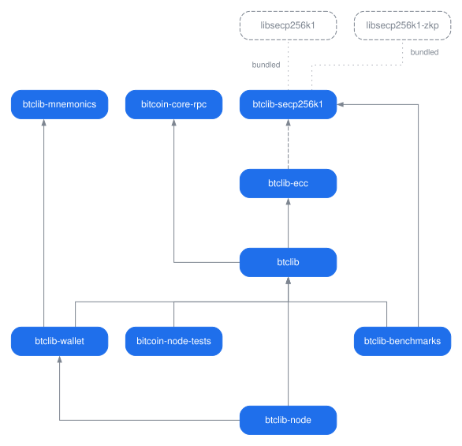

---
# Generated by .github/scripts/derive-homepage.sh, and not
# written here: this file is btclib-org/.github's
# profile/README.md at the commit below, under front matter.
# An edit made here is what homepage.yml refuses; what to do
# instead is CONTRIBUTING.md's "Changing the homepage".
layout: default
source_repository: btclib-org/.github
source_path: profile/README.md
source_commit: da06c7cf5357b9add45b9afd106f902265dd6ad2
---
# btclib.org

Bitcoin cryptography in Python, written to be read.

These libraries grew out of Ferdinando Ametrano's *[Bitcoin and
Blockchain Technology](https://www.ametrano.net/bbt/)* course (Università
di Milano-Bicocca, Politecnico di Milano, Università Statale di Milano,
ESSEC Paris) and are used in production today. They are fully type
annotated, cite the BIP, RFC or Bitcoin Core function a behaviour comes
from, and are still marked beta because they are still refactored
whenever that makes them clearer.

## The libraries

- **[btclib-secp256k1](https://github.com/btclib-org/btclib-secp256k1)**
  — Python bindings to
  [libsecp256k1](https://github.com/bitcoin-core/secp256k1), Bitcoin
  Core's optimized C library.
- **[btclib-ecc](https://github.com/btclib-org/btclib-ecc)** — elliptic
  curve arithmetic over any short Weierstrass curve, and the schemes
  built on it: ECDSA, BIP340 Schnorr, MuSig2, FROST, Diffie-Hellman,
  commitments and range proofs. For secp256k1 it uses btclib-secp256k1,
  and tests its own arithmetic against it.
- **[btclib](https://github.com/btclib-org/btclib)** — bitcoin's
  protocol on top of btclib-ecc: addresses, scripts, transactions and
  blocks.
- **[btclib-mnemonics](https://github.com/btclib-org/btclib-mnemonics)** —
  BIP39, SLIP39 and Electrum mnemonics, from the entropy up to the seed,
  and nothing of bitcoin above it.
- **[btclib-wallet](https://github.com/btclib-org/btclib-wallet)** —
  from a seed to a signed, broadcast transaction: BIP32 keys, BIP39 and
  SLIP39 mnemonics, descriptors, PSBT, coin selection.
- **[bitcoin-core-rpc](https://github.com/btclib-org/bitcoin-core-rpc)**
  — a JSON-RPC client for Bitcoin Core, with nothing but the standard
  library behind it.
- **[btclib-benchmarks](https://github.com/btclib-org/btclib-benchmarks)**
  — timings against comparable libraries, kept apart so btclib never
  depends on them.

## Around them

- **[btclib-node](https://github.com/btclib-org/btclib-node)** — a
  bitcoin full node in Python, built on btclib.
- **[bitcoin-node-tests](https://github.com/btclib-org/bitcoin-node-tests)**
  — Bitcoin Core's functional tests rewritten on btclib, to test any
  node against bitcoind.
- **[bbt](https://github.com/btclib-org/bbt)** — the course material:
  spreadsheets, notebooks, scripts and a regtest lab.
- **[portanode](https://github.com/btclib-org/portanode)** — Bitcoin
  Core and Electrum on a portable disk, for macOS, Windows and Linux.
- **[.github](https://github.com/btclib-org/.github)** — this page, and
  the standard every repository here follows.
- **[claude-process](https://github.com/btclib-org/claude-process)** —
  the process the maintainers follow with Claude Code: the
  `/btclib-org` command and the writer and reviewer agents.
- **[btclib-org.github.io](https://github.com/btclib-org/btclib-org.github.io)**
  — the site serving this page at btclib.org.

## How they depend on each other

An arrow points at what a package depends on, which is on a row above
it, and a dashed one at what only an extra of the package installs. An
arrow is drawn only where the package does not already install its
target through the arrows that are drawn, so `btclib-wallet` has none to
`btclib-ecc`, which `btclib` brings. `btclib-node` keeps its own to
`btclib` all the same, asking it for the `secp256k1` extra, which
`btclib-wallet` installs `btclib` without. A grey dashed box is a C
library and not a package of the organization: the dotted line to it
says `btclib-secp256k1` bundles it, built in rather than installed beside
it.

## Tested against other people's vectors

The suites answer to vectors published by others (BIPs and SLIPs,
Bitcoin Core, HWI, Trezor, RFC 6979), each pinned to its upstream commit
and re-checked weekly. Coverage is held at 100%.

## Contributing

Issues and pull requests go to each repository; its README and
`CONTRIBUTING.md` say how. A change needs a clean lint gate, a passing
suite at full coverage and a signed commit.

## License

MIT.

---

The btclib organization and its projects are actively supported by
[DGI](https://dgi.io) and [CheckSig](https://checksig.com).
